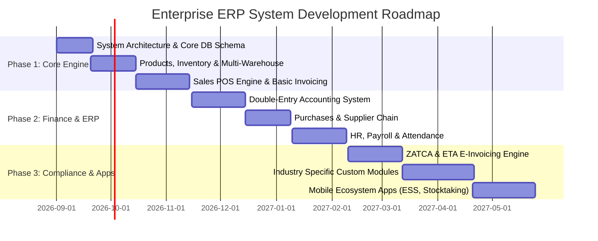

# Enterprise ERP & Multi-Industry POS System Specification
## (কম্প্রিহেনসিভ সিস্টেম ফিচার ও ফাংশনাল স্পেসিফিকেশন)

---

## 1. 🏗️ সিস্টেম আর্কিটেকচার ও ডিজাইন প্যাটার্ন (System Architecture)

### 1.1 হাইব্রিড ডেপ্লয়মেন্ট মডেল (Hybrid Desktop & Cloud Architecture)
* **ডেস্কটপ অ্যাপ্লিকেশন:** Electron + React (Vite) + Local SQLite Database।
* **ক্লাউড সার্ভার (Central API):** Node.js / Express (বা NestJS) + PostgreSQL / MySQL Database + Redis Caching।
* **মোবাইল অ্যাপ্লিকেশনস:** React Native / Flutter (Android & iOS)।
* **অফলাইন-ফার্স্ট ডিএসওয়াইএনসি ইঞ্জিন (Offline-First Sync Engine):**
  - ডেস্কেটপ পিওএস (POS) অফলাইনে কাজ করবে। সমস্ত কেনাকাটা ও ট্রানজ্যাকশন লোকাল SQLite ডাটাবেসে `sync_status = 'pending'` হিসেবে সংরক্ষিত হবে।
  - ইন্টারনেট সংযোগ পাওয়া মাত্রই ব্যাকগ্রাউন্ড ওয়ার্কার `SyncManager` ট্রানজ্যাকশনগুলো সিকোয়েন্সিয়ালি ক্লাউড ব্যাকএন্ডে পাঠাবে (Conflict Resolution strategies: Timestamp Ordering / Server Override)।

### 1.2 সিকিউরিটি ও মাল্টি-টেনেন্সি (Security & Security Model)
* **Tenant Isolation:** প্রতিটি প্রতিষ্ঠানের জন্য আলাদা `tenant_id` অথবা আলাদা ডেডিকেটেড ডাটাবেস স্কিমা।
* **Authentication:** JWT (JSON Web Tokens) + Refresh Token + Device Hardware ID Binding।
* **Role-Based Access Control (RBAC):** গ্র্যানুলার পারমিশন (যেমন: `sales.invoice.create`, `sales.invoice.delete`, `accounting.ledger.view`) সহ কাস্টম রোল তৈরি।

---

## 2. 📋 মডিউল-ভিত্তিক পূর্ণাঙ্গ কার্যপ্রণালী (Detailed Module Specifications)

---

### 2.1 💰 SALES & E-INVOICING (বিক্রয় ও ইলেকট্রনিক ইনভয়েসিং)

#### 2.1.1 Invoices and Estimates (ইনভয়েস ও এস্টিমেট)
- **Quotation/Estimate Generation:** পণ্যের তালিকা, ডিসকাউন্ট, ট্যাক্স এবং কাস্টম শর্তাবলী সহ কোটেশন তৈরি।
- **Estimate-to-Invoice Conversion:** গ্রাহক কোটেশন অনুমোদন করলে এক ক্লিকে ইনভয়েসে রূপান্তর।
- **Recurring Invoices:** মাসিক/বার্ষিক সাবস্ক্রিপশনযুক্ত গ্রাহকদের জন্য স্বয়ংক্রিয় নির্ধারিত তারিখে অটো-ইনভয়েস জেনারেট করা।
- **Pro-Forma & Credit/Debit Notes:** পেমেন্ট পূর্ববর্তী প্রো-ফরমা ইনভয়েস এবং সেলস রিটার্ন এর জন্য ক্রেডিট নোট ইস্যু।

#### 2.1.2 Advanced Payments (অ্যাডভান্সড পেমেন্টস)
- **Unallocated Customer Advance:** কোনো ইনভয়েসের সাথে যুক্ত না করে গ্রাহকের থেকে অগ্রিম টাকা জমা নেওয়া এবং লেজারে 'Advance Credit' হিসেবে রাখা।
- **Invoice Allocation Ledger:** পরবর্তীতে ইনভয়েস তৈরি হলে জমানো অ্যাডভান্স থেকে সম্পূর্ণ বা আংশিক সামঞ্জস্য (Adjustment) করা।
- **Advance Refund:** অব্যবহৃত অগ্রিম অর্থ ক্লায়েন্টকে ফেরত প্রদান।

#### 2.1.3 Point of Sales - POS (পয়েন্ট অফ সেলস)
- **Ultra-Fast Checkout Interface:** কী-বোর্ড শর্টকাট (F1-F12), টাচ-স্ক্রিন প্যানেল এবং কুইক প্রোডাক্ট গ্রিড।
- **Barcode & Serial Scanner:** বারকোড স্ক্যান করার সাথে সাথে কার্টে আইটেম যুক্ত হওয়া এবং স্টক চেক করা।
- **Multi-Payment Split:** একটি ইনভয়েসের জন্য আংশিক নগদ (Cash), আংশিক কার্ড (Card) বা মোবাইল ব্যাংকিং গ্রহণ।
- **Cart Hold/Resume:** কার্ট সাময়িকভাবে পেন্ডিং (Hold) রেখে অন্য কাস্টমারের বিল করা এবং পুনরায় চালু করা।
- **Hardware Integration:** থার্মাল রসিদ প্রিন্টার (80mm/58mm), ক্যাশ ড্রয়ার (ESC/POS কমান্ড), ওয়েইং স্কেল (Weight Scale) এবং কাস্টমার ডিসপ্লে প্যানেল।

#### 2.1.4 Installments (কিস্তি ভিত্তিক বিক্রয়)
- **Down Payment Calculation:** মূল মূল্যের নির্দিষ্ট শতাংশ ডাউনপেমেন্ট হিসেবে গ্রহণ।
- **Installment Schedule Engine:** সাপ্তাহিক, দ্বিপাক্ষিক বা মাসিক ভিত্তিতে সুনির্দিষ্ট তারিখসহ কিস্তির তালিকা (Repayment Schedule) তৈরি।
- **Interest Models:** ফ্ল্যাট রেট (Flat Rate) বা হ্রাসমান ব্যালেন্স (Reducing Balance) সুদের হার প্রয়োগ।
- **Late Fee & Penalty:** নির্ধারিত তারিখ পার হলে স্বয়ংক্রিয়ভাবে দৈনিক/মাসিক লেট ফি যুক্ত হওয়া।
- **Installment Ledger:** প্রতি কিস্তির জমার রসিদ এবং অবশিষ্ট ব্যালেন্স ট্র্যাকিং।

#### 2.1.5 Sales Target & Commissions (বিক্রয় লক্ষ্যমাত্রা ও কমিশন)
- **Target Metrics:** সেলস এজেন্টদের জন্য বিক্রয় পরিমাণ (Volume) বা রাজস্বের (Revenue) ওপর মাসিক টার্গেট নির্ধারণ।
- **Commission Calculation Types:** 
  - বিক্রয়ের মোট অর্থমূল্যের ওপর নির্দিষ্ট %।
  - পণ্যের মুনাফার (Profit Margin) ওপর নির্দিষ্ট %।
  - টার্গেট অর্জিত হলে বোনাস বা স্ল্যাবভিত্তিক (Tiered) কমিশন।
- **Commission Payout Vouchers:** অনুমোদন প্রাপ্ত কমিশন পে-রোল বা পে-আউট ভাউচারের মাধ্যমে প্রদান।

#### 2.1.6 Shop Front & Digital Catalog (অনলাইন ক্যাটালগ)
- **Customer Self-Catalog:** ইনভেন্টরির সাথে সংযুক্ত একটি ডিজিটাল ওয়েব পেজ যেখানে কাস্টমার প্রোডাক্ট দেখতে ও অর্ডার প্লেস করতে পারে।
- **Order Reception in POS:** শপ ফ্রন্ট থেকে আসা অর্ডার সরাসরি পিওএস/ইনভয়েস পেন্ডিং লিস্টে জমা হওয়া।

#### 2.1.7 Loyalty Points (লয়ালটি পয়েন্ট প্রোগ্রাম)
- **Point Earning Rules:** প্রতি ১০০ টাকা কেনাকাটায় নির্দিষ্ট পয়েন্ট অর্জনের রুলস (যেমন: 100 BDT = 1 Point)।
- **Redemption Rules:** পয়েন্টের আর্থিক মূল্য নির্ধারণ (যেমন: 1 Point = 0.50 BDT) এবং ইনভয়েস বিল থেকে মাইনাস করার সুবিধা।
- **Customer Tiering:** পয়েন্টের ওপর ভিত্তি করে Silver, Gold, Platinum গ্রাহক শ্রেণিবিভাগ।

#### 2.1.8 Insurance Agents (বীমা এজেন্ট মডিউল)
- **Policy Mapping:** প্রতিটি অর্ডারের সাথে বীমা পলিসি এবং এজেন্টের নাম যুক্ত করা।
- **Co-Pay Calculation:** ক্লায়েন্টের পরিশোধযোগ্য অংশ এবং ইন্স্যুরেন্স কোম্পানির ক্লেইমেবল অংশ আলাদা ইনভয়েসিং করা।

#### 2.1.9 Multi-Country E-Invoicing Engine (আন্তর্জাতিক ই-ইনভয়েসিং)
- 🇸🇦 **Saudi Arabia (ZATCA Phase 1 & Phase 2):**
  - Standard (B2B) & Simplified (B2C) Invoices।
  - Cryptographic Stamp, Unique UUID, Invoice Counter Number, Hash Chaining (Previous Invoice SHA256 Hash)।
  - QR Code Generation (Tag 1: Seller Name, Tag 2: VAT No, Tag 3: Timestamp, Tag 4: Total, Tag 5: VAT Total, Tag 6: ECDSA Hash, Tag 7: ECDSA Signature)।
  - UBL 2.1 XML ফরম্যাটে ZATCA Portal এ Compliance & Clearance API কল।
- 🇪🇬 **Egypt (ETA - Egyptian Tax Authority):**
  - JSON Envelope Structuring।
  - Hardware Security Module (HSM) ডিজিটাল সিগনেচার ইন্টিগ্রেশন।
  - ETA Web API ইন্টিগ্রেশন (Submit Documents & Sync Status)।
- 🇦🇪 **UAE (FTA VAT) & 🇯🇴 Jordan (JOFOTEX):**
  - স্থানীয় ভ্যাট রেট (5%/16%), TRN (Tax Registration Number) স্ট্যান্ডার্ড রসিদ।

---

### 2.2 👥 CLIENTS & CRM (গ্রাহক ও সিআরএম মডিউল)

#### 2.2.1 Client Master & Credit Limits
- **Client Ledger:** কাস্টমারের যাবতীয় লেনদেন, বকেয়া, রিসিভ এবং স্টেটমেন্ট ডাউনলোডের সুযোগ।
- **Credit Limit Control:** গ্রাহকের সর্বোচ্চ বাকি বকেয়ার সীমা নির্ধারণ। সীমা পার হলে POS/ইনভয়েসে সিস্টেম অটো-ব্লক দেবে।

#### 2.2.2 Clients Follow-up & CRM Pipeline
- **Lead Pipeline:** Prospect ➔ Contacted ➔ Proposal Sent ➔ Closed Won / Lost।
- **Interaction History:** ফোন কল রেকর্ড, নোটস, ইমেইল হিস্ট্রি এবং পরবর্তী ফলো-আপ ডেট রিমাইন্ডার।

#### 2.2.3 Clients Attendance & Access Control
- **Visits Tracker:** সার্ভিস সেন্টার, ক্লাব বা জিম ক্লায়েন্টদের কিউআর/আরএফআইডি দিয়ে চেক-ইন ট্র্যাকিং।

#### 2.2.4 Points & Credits
- **Store Credit Ledger:** পণ্য ফেরত (Sales Return) দিলে নগদ টাকা না দিয়ে স্টোর ক্রেডিট প্রদান যা পরবর্তীতে কেনাকাটায় ব্যবহারযোগ্য।

#### 2.2.5 Memberships & Subscriptions
- **Subscription Management:** মাসিক, তিন মাসিক বা বার্ষিক মেম্বারশিপ প্যাকেজ জেনারেট করা।
- **Auto-Renewal & Expiration Alerts:** মেম্বারশিপের মেয়াদ শেষের পূর্বে স্বয়ংক্রিয় এসএমএস/ইমেইল এবং অটো-রিনিউ ইনভয়েস।

---

### 2.3 📦 INVENTORY & WAREHOUSES (ইনভেন্টরি ও গুদাম ব্যবস্থাপনা)

#### 2.3.1 Manage Warehouses (মাল্টি-ওয়্যারহাউস)
- **Multi-Store Mapping:** প্রধান গুদাম, শাখা গুদাম এবং বিন/র‍্যাক (Bin/Rack Location) ট্র্যাকিং।
- **Inter-Warehouse Transfer:** এক গুদাম থেকে অন্য গুদামে পণ্য স্থানান্তরের চালান তৈরি ও স্টকের স্বয়ংক্রিয় সমন্বয়।

#### 2.3.2 Requisitions (পণ্য চাহিদা পত্র)
- **Material Requisition Note (MRN):** শোরুম বা ব্রাঞ্চ থেকে প্রধান গুদামে চাহিদাপত্র পাঠানো।
- **Approval Workflow:** ম্যানেজারের অনুমোদনের পর স্টক ইস্যু এবং রিসিভ কনফার্মেশন।

#### 2.3.3 Manage Stocktakings (স্টক অডিট ও গণনা)
- **Physical vs System Audit:** হ্যান্ডহেল্ড বারকোড স্ক্যানার দিয়ে শারীরিকভাবে স্টক গুনে সিস্টেমে এন্ট্রি দেওয়া।
- **Variance Analysis:** সিস্টেম স্টক এবং প্রকৃত স্টকের গরমিল বের করা।
- **Auto Adjustment Vouchers:** পার্থক্য অনুযায়ী 'Stock Gain' বা 'Stock Loss' ভাউচার অটোমেটিক অ্যাকাউন্টিংয়ে হিট করা।

#### 2.3.4 Products & Services Master
- **Product Categorization:** ক্যাটাগরি, সাব-ক্যাটাগরি, ব্র্যান্ড এবং মেজারমেন্ট ইউনিট (UOM)।
- **Service Items:** যেসব আইটেমের ফিজিক্যাল স্টক নেই (যেমন: কনসালটেন্সি, মেকানিক চার্জ)।

#### 2.3.5 Price Lists (মাল্টিপল মূল্য তালিকা)
- **Custom Tier Pricing:** খুচরা ক্রেতা, পাইকারি ক্রেতা এবং করপোরেট ক্লায়েন্টের জন্য আলাদা মূল্যতালিকা প্রস্তুত রাখা।
- **Date-Bound Promotions:** নির্দিষ্ট সময়কালের জন্য ছাড় ও প্রোমোশনাল প্রাইস সেটআপ।

#### 2.3.6 Unit Templates (একক রূপান্তর)
- **Conversion Engine:** ১ কার্টন = ১২ পিস, ১ কেজি = ১০০০০ গ্রাম। ইনভয়েসে কার্টনে বা পিসে বিক্রি করলে গুদামে মূল একক থেকে সঠিকভাবে স্টক কমবে।

#### 2.3.7 Bundle Products (কম্বো প্যাক)
- **Kit Assembly:** একাধিক পণ্য একত্রে একটি বান্ডিল প্রোডাক্ট (যেমন: "Gift Pack A") হিসেবে বিক্রয়।
- **Component Deduction:** বান্ডিল বিক্রি হলে বান্ডিলের অন্তর্ভুক্ত প্রতিটি স্বতন্ত্র পণ্যের স্টক স্বয়ংক্রিয়ভাবে কমবে।

#### 2.3.8 Product Tracking (সিরিয়াল, ব্যাচ ও এক্সপায়ারি)
- **Batch & Expiry Management:** ফার্মা বা খাদ্যপণ্যের জন্য ব্যাচ নম্বর এবং FEFO (First Expired, First Out) নীতিতে পণ্য বিক্রয়।
- **Serial / IMEI Tracking:** ইলেকট্রনিক্স বা মোবাইলের জন্য প্রতিটি স্বতন্ত্র পিসের পৃথক সিরিয়াল/IMEI এন্ট্রি এবং ওয়ারেন্টি ট্র্যাকিং।

#### 2.3.9 Inventory Settings
- **Valuation Methods:** FIFO (First In, First Out) এবং Weighted Average Costing পদ্ধতি নির্বাচন।
- **Safety Stock & Reorder Alert:** মজুদ একটি নির্দিষ্ট সীমায় নেমে এলে অটোমেটিক রিকুইজিশন অ্যালার্ট জেনারেট হওয়া।

---

### 2.4 🏭 MANUFACTURING & PRODUCTION (উৎপাদন মডিউল)

#### 2.4.1 Bill of Materials (BOM)
- **Recipe Formulation:** ১ ইউনিট ফিনিশড গুডস তৈরি করতে প্রয়োজনীয় কাঁচামালের তালিকা (Raw Materials Breakdown)।
- **Overhead & Scrap Allocation:** উৎপাদনের সময় আনুমানিক অপচয় (Scrap %) এবং পরোক্ষ খরচ (Overhead cost) অন্তর্ভুক্ত করা।

#### 2.4.2 Production Work Orders
- **Stage 1 - Staging:** কাঁচামাল স্টোর থেকে প্রোডাকশন ফ্লোরে ইস্যু করা (Raw Material Consumption)।
- **Stage 2 - WIP (Work-in-Progress):** উৎপাদন প্রক্রিয়াধীন রাখা।
- **Stage 3 - Finished Goods Receipt:** উৎপাদন শেষে ফিনিশড প্রোডাক্টের স্টক মূল গুদামে জমা করা এবং COGS হিসেব করা।

---

### 2.5 🛒 PURCHASES & SUPPLIERS (ক্রয় ও সরবরাহকারী)

#### 2.5.1 Purchase Requests & RFQ
- **RFQ (Request for Quotation):** সরবরাহকারীদের তালিকা থেকে দরপত্র আহ্বান করা এবং উদ্ধৃতি সংগ্রহ করা।
- **Quotation Comparison Sheet:** একাধিক সরবরাহকারীর দরপত্রের তুলনামূলক বিশ্লেষণ।

#### 2.5.2 Purchase Orders (PO) & Invoices
- **Purchase Order (PO):** অনুমোদিত সরবরাহকারীকে পণ্য সরবরাহের আনুষ্ঠানিক আদেশনামা পাঠানো।
- **Goods Received Note (GRN):** পণ্যের চালান গুদামে পৌঁছালে ইন্সপেকশন করা এবং আংশিক/সম্পূর্ণ রিসিভ করা।
- **3-Way Matching:** PO, GRN এবং Purchase Invoice-এর তথ্য মিলিয়ে দেখে অ্যাকাউন্টসে বিল পাস করা।
- **Landed Cost Allocation:** শিপিং কস্ট, শুল্ক এবং ফ্রিট চার্জ পণ্যের ক্রয়মূল্যের সাথে আনুপাতিকহারে বণ্টন করা।

#### 2.5.3 Manage Suppliers
- **Supplier Ledger:** সরবরাহকারীদের পাওনা, পেমেন্ট ভাউচার এবং ডেবিট নোট (Purchase Return) লেজার।

---

### 2.6 📊 ACCOUNTING & FINANCE (হিসাববিজ্ঞান ও অর্থ ব্যবস্থাপনা)

#### 2.6.1 Double-Entry General Ledger System
- **Chart of Accounts (COA):** ৫টি প্রধান ক্যাটাগরি (Assets, Liabilities, Equity, Revenue, Expenses) সমৃদ্ধ কাস্টমাইজযোগ্য ফিন্যান্সিয়াল ট্রি।
- **Automatic Postings:** বিক্রয়, ক্রয়, বেতন বা স্টকের লেনদেনের সাথে সাথে ব্যাকগ্রাউন্ডে স্বয়ংক্রিয় ডেবিট-ক্রেডিট ভাউচার তৈরি।
- **Manual Journal Vouchers (JV):** অ্যাডজাস্টমেন্ট ও সাধারণ খরচের জন্য ম্যানুয়াল জার্নাল এন্ট্রি।

#### 2.6.2 Cheque Cycle Management (চেক ট্র্যাকিং)
- **Lifecycle Statuses:** 
  1. `Cheque Received / Issued` (প্রাপ্ত বা প্রদানকৃত চেক)
  2. `Deposited to Bank` (ব্যাংকে জমা প্রদান)
  3. `Cleared` (ব্যাংক থেকে টাকা যুক্ত বা বিয়োগ হওয়া)
  4. `Bounced / Dis-honored` (চেক বাউন্স করলে স্বয়ংক্রিয় কাস্টমার/সাপ্লায়ার লেজারে রিভার্সাল এন্ট্রি)

#### 2.6.3 Financial Reports
- **Real-Time Reports:** Trial Balance, Profit & Loss Statement (P&L), Balance Sheet, Cash Flow Statement, Ledger Detail।

---

### 2.7 👨‍💼 HR & PAYROLL (মানবসম্পদ ও পে-রোল)

#### 2.7.1 Employee Profiles & Org Tree
- **Organizational Hierarchy:** ডিপার্টমেন্ট, ডেজিগনেশন এবং রিপোর্টিং লাইন ম্যানেজমেন্ট।

#### 2.7.2 Attendance & Timesheets
- **Biometric API Integration:** জেডকেটেকো (ZKTeco) সহ বায়োমেট্রিক ডিভাইসের ডাটা সরাসরি সিঙ্ক।
- **ESS App Attendance:** মোবাইল অ্যাপের জিও-ফেন্সিং (GPS Coordinates) এবং ফেস রিকগনিশন দ্বারা উপস্থিতি প্রদান।

#### 2.7.3 Manage Contracts & Payroll Process
- **Salary Components:** বেসিক, বাড়ি ভাড়া, চিকিৎসা ভাতা, যাতায়াত ভাতা, ওভারটাইম এবং বোনাস সেটআপ।
- **Automatic Payroll Run:** উপস্থিতি ও ছুটির হিসেব কষে এক ক্লিকে সম্পূর্ণ কোম্পানির বেতন নির্ধারণ এবং ব্যাংক পে-রোল ফাইল এক্সপোর্ট।
- **Payslip Distribution:** কর্মচারীর ইমেইল ও অ্যাপে অটো পে-স্লিপ পৌঁছানো।

#### 2.7.4 Manage Requests
- **Leave & Loan Management:** ছুটি, অগ্রিম বেতন (Advance Salary) এবং রিইমবার্সমেন্ট আবেদন ও অনুমোদন।

---

### 2.8 ⚙️ OPERATIONS, WORK ORDERS & RENTALS (অপারেশনস মডিউল)

#### 2.8.1 Work Orders & Technical Services
- **Job Cards:** সার্ভিসিং সেন্টারের জন্য গ্রাহকের ডিভাইসের সমস্যা লিখে জব কার্ড তৈরি এবং টেকনিশিয়ান নির্ধারণ।
- **Spare Parts Consumption:** সার্ভিসিংয়ে ব্যবহৃত যন্ত্রাংশ ইনভেন্টরি থেকে কেটে নেওয়া।

#### 2.8.2 Custom Workflows
- **Kanban Pipeline:** ড্রাগ-অ্যান্ড-ড্রপ সুবিধা সহ কাস্টম কাজের স্টেজ (e.g., Received ➔ Diagnosing ➔ Waiting for Parts ➔ Repaired ➔ Delivered)।

#### 2.8.3 Rental and Unit Management
- **Asset Track:** রেন্টাল আইটেম (যেমন: গাড়ি, ইকুইপমেন্ট, প্রপার্টি রুম) বুকিং ট্র্যাকিং।
- **Meter Reading Logs:** শুরু এবং শেষের মিটার/ওডোমিটার রিডিং অনুযায়ী ভাড়া হিসাব করা।

#### 2.8.4 PNR (Passenger Name Record)
- **Travel Ticketing:** টিকিট বুকিং, প্যাসেঞ্জার ডাটা এবং ট্রাভেল এজেন্সির কমিশন হিসাব রাখা।

---

### 2.9 🛠️ SETTINGS & INTEGRATIONS (সিস্টেম সেটআপ)

- **Tax Settings:** ভ্যাট (VAT), জিএসটি (GST), উইথহোল্ডিং ট্যাক্স এবং রিজিওনাল ট্যাক্স রুলস।
- **Payment Methods:** Cash, Credit Card, Bank Transfer, Mobile Wallets (bKash, Nagad, MFS), POS Terminal integrations।
- **Auto Numbering:** ইনভয়েস, PO, এবং Vouchers এর জন্য প্রিফিক্স/সাফিক্স সেটআপ (e.g., `INV-2026-00001`)।
- **SMTP & SMS Gateways:** SMS (Twilio, Bulk SMS API) এবং ইমেইলের জন্য কাস্টম SMTP ইন্টিগ্রেশন।
- **Multi-Branch:** সেন্ট্রাল কন্ট্রোল প্যানেল থেকে একাধিক ব্রাঞ্চের পারমিশন ও এক্সেস নিয়ন্ত্রণ।

---

### 2.10 🏢 INDUSTRY-SPECIFIC MODULES (নির্দিষ্ট শিল্পের বিশেষ কাস্টমাইজেশন)

1. **Autoparts Store & Warehousing:** OEM পার্টস নম্বর দ্বারা অনুসন্ধান, গাড়ির মডেল সামঞ্জস্যতা (Compatibility Chart) এবং অল্টারনেটিভ পার্ট সাজেস্ট করা।
2. **Beauty Salons:** স্টাইলিস্টের অ্যাপয়েন্টমেন্ট শিডিউলিং, স্টাইলিস্ট ভিত্তিক কমিশন এবং সার্ভিস প্যাক।
3. **Car Rental Management:** গাড়ির লাইসেন্স, ইনস্যুরেন্স মেয়াদের তারিখ, ডেইলি/আওয়ারলি রেট এবং সিকিউরিটি ডিপোজিট।
4. **Dental & Medical Clinics:** রোগীর ডেন্টাল চার্ট/প্রেসক্রিপশন জেনারেটর, পেমেন্ট ট্র্যাকিং এবং অ্যাপয়েন্টমেন্ট ক্যাটালগ।
5. **Eyewear & Optics Shop:** চশমার পাওয়ার স্পেসিফিকেশন (Spherical, Cylinder, Axis, Addition) সহ লেন্স এবং ফ্রেমের অর্ডারিং ইনভয়েস।
6. **Gym & Fitness Club:** কাস্টমার প্রবেশের সাথে সাথে ডিজিটাল মেম্বারশিপ বারকোড/RFID রিডিং এবং মেয়াদ শেষ হলে অটোমেটিক গেট লক এক্সেস।
7. **Hotel Management Software:** রুম ম্যাপিং (Vacant, Occupied, Cleaning), চেক-ইন/আউট, রুম সার্ভিস বিলিং।
8. **Law Firms & Legal Practice:** কেস ফাইল ট্র্যাকিং, শুনানির তারিখ (Court Hearing Schedule) এবং আওয়ারলি বিলিং।
9. **Online Store Management:** ই-কমার্স APIs (WooCommerce / Shopify / Custom REST) সিঙ্ক।
10. **Pharmacy Management:** ড্রাগ জেনেরিক নেম অনুসন্ধান, অপব্যবহারযোগ্য ড্রাগ ট্র্যাকিং এবং এক্সপায়ারি নোটিফিকেশন।
11. **PlayStation Cafe / Gaming:** ডিভাইস টাইম-ট্র্যাকিং প্যানেল। প্লে-টাইম শুরু থেকে শেষ হলে অটোমেটিক সময় ও প্লে-ফি হিসাব করে ইনভয়েস তৈরি।
12. **Printing & Advertising Management:** ডাইমেনশন ভিত্তিক হিসাব (দৈর্ঘ্য × প্রস্থ × প্রতি বর্গফুটের রেট) অনুযায়ী বিল তৈরি।
13. **Restaurant Management:** টেবিল লেআউট প্যানেল, KDS (Kitchen Display System) টিকেট পাঠানো এবং রেসিপি উপাদান হিসাব (Kitchen BOM)।
14. **Retail Stores Management:** ফাস্ট-ক্যাশ কাউন্টার, সেলস রিটার্ন নীতি এবং লয়ালটি ক্লাব।

---

### 2.11 📱 ECOSYSTEM APPLICATIONS (সিস্টেমের সঙ্গে যুক্ত অ্যাপসমূহ)

1. **Attendance Registration ESS App:** কর্মচারীদের আত্ম-উপস্থিতি এবং ছুটির আবেদন প্রদান।
2. **Daftra Mobile App:** ব্যবসায়ীদের জন্য রিয়েল-টাইম সেলস এবং রিপোর্টিং ড্যাশবোর্ড।
3. **Stocktaking App:** গুদামে সরাসরি ফোনের ক্যামেরা দিয়ে বারকোড স্ক্যান করে দ্রুত স্টক অডিট করা।
4. **Electronic Invoice Scanner:** ZATCA/ETA QR কোড তাৎক্ষণিক স্ক্যান ও ভ্যালিডেশন অ্যাপ।
5. **POS Desktop & Mobile App:** ট্যাবলেটে বা ডেস্কেটপে দ্রুত পয়েন্ট অব সেলস চালানোর অ্যাপ।
6. **Quick Expenses Scanner App:** ওসিআর (OCR) প্রযুক্তি দিয়ে রসিদের ছবি থেকে স্বয়ংক্রিয়ভাবে এক্সপেন্স তথ্য উদ্ধার করা।

---

### 2.12 📈 REPORTS & ANALYTICS (রিপোর্ট ও এনালিটিক্স)

- **Sales Reports:** বিক্রয়ের দৈনিক/মাসিক সারাংশ, ক্যাশিয়ার ভিত্তিক সেলস, প্রফিট মার্জিন রিপোর্ট।
- **Purchases Reports:** ক্রয় হিসাব, সাপ্লায়ার বকেয়া এবং GRN স্ট্যাটাস।
- **Accounting Reports:** ডে-বুক, ভাউচার লিস্ট, জেনারেল লেজার, ট্রায়াল ব্যালেন্স, পিঅ্যান্ডএল।
- **System Activity Audit Log:** প্রতিটি ব্যবহারকারীর প্রতিটি অ্যাকশন (যেমন: ইনভয়েস পরিবর্তন, স্টক ম্যানুয়ালি ডিলিট করা) সময় ও আইপি সহ আইসোলেটেড লগ।
- **Other Reports:** Cheque Reports, Client Reports, Employee Reports, Manufacturing Reports, PNR Reports, Points & Credits Reports, Rental Reports, Store Stock Valuation Reports।

---

## 3. 🛠️ ইআরডি ও ডাটাবেস ডিজাইন কনসেপ্ট (Database Schema Structure)

সিস্টেমের প্রধান টেবিলগুলোর স্ট্রাকচার নিচে দেওয়া হলো:

```sql
-- Tenants / Companies Table
CREATE TABLE tenants (
    id VARCHAR(36) PRIMARY KEY,
    name VARCHAR(255) NOT NULL,
    country_code VARCHAR(5) DEFAULT 'SA',
    currency VARCHAR(10) DEFAULT 'SAR',
    created_at TIMESTAMP DEFAULT CURRENT_TIMESTAMP
);

-- Users & RBAC
CREATE TABLE users (
    id VARCHAR(36) PRIMARY KEY,
    tenant_id VARCHAR(36) REFERENCES tenants(id),
    name VARCHAR(150),
    email VARCHAR(150) UNIQUE,
    password_hash VARCHAR(255),
    role_id INT,
    is_active BOOLEAN DEFAULT TRUE
);

-- Products Master
CREATE TABLE products (
    id VARCHAR(36) PRIMARY KEY,
    tenant_id VARCHAR(36) REFERENCES tenants(id),
    sku VARCHAR(100) UNIQUE,
    name VARCHAR(255) NOT NULL,
    product_type ENUM('standard', 'service', 'bundle', 'batch', 'serial'),
    unit_id INT,
    purchase_price DECIMAL(15, 4),
    selling_price DECIMAL(15, 4),
    min_reorder_level INT DEFAULT 10,
    created_at TIMESTAMP DEFAULT CURRENT_TIMESTAMP
);

-- Stock Ledger (Multi-Warehouse)
CREATE TABLE stock_ledger (
    id BIGINT AUTO_INCREMENT PRIMARY KEY,
    tenant_id VARCHAR(36),
    warehouse_id VARCHAR(36),
    product_id VARCHAR(36),
    batch_number VARCHAR(100) NULL,
    serial_number VARCHAR(100) NULL,
    quantity_change DECIMAL(15, 4),
    transaction_type ENUM('PURCHASE', 'SALE', 'TRANSFER', 'ADJUSTMENT', 'MANUFACTURING'),
    reference_id VARCHAR(36),
    created_at TIMESTAMP DEFAULT CURRENT_TIMESTAMP
);

-- Sales Invoices
CREATE TABLE invoices (
    id VARCHAR(36) PRIMARY KEY,
    tenant_id VARCHAR(36),
    invoice_number VARCHAR(100) NOT NULL,
    client_id VARCHAR(36),
    invoice_date DATE NOT NULL,
    due_date DATE,
    subtotal DECIMAL(15, 2),
    tax_total DECIMAL(15, 2),
    discount_total DECIMAL(15, 2),
    grand_total DECIMAL(15, 2),
    payment_status ENUM('unpaid', 'partially_paid', 'paid') DEFAULT 'unpaid',
    zatca_uuid VARCHAR(100) NULL,
    zatca_hash VARCHAR(255) NULL,
    created_at TIMESTAMP DEFAULT CURRENT_TIMESTAMP
);
```

---

## 4. 📅 ধাপ অনুযায়ী ইমপ্লিমেন্টেশন রুটম্যাপ (Implementation Phases)



---

> 💡 **নোট:** এই স্পেসিফিকেশন ডকুমেন্টটি আপনার পুরো ইআরপি প্রজেক্টের প্রধান আর্কিটেকচারাল গাইড হিসেবে কাজ করবে। পরবর্তীতে কোডিং শুরু করার সময় এই ডকুমেন্টের প্রতিটি মডিউল অনুযায়ী কোড ইমপ্লিমেন্ট করা হবে।
